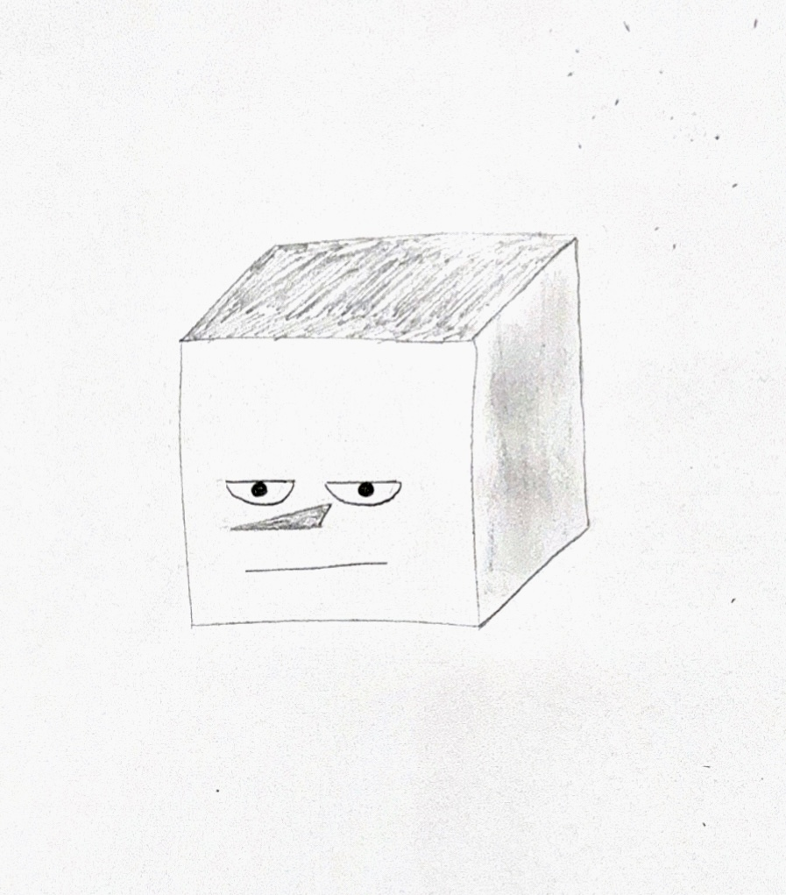
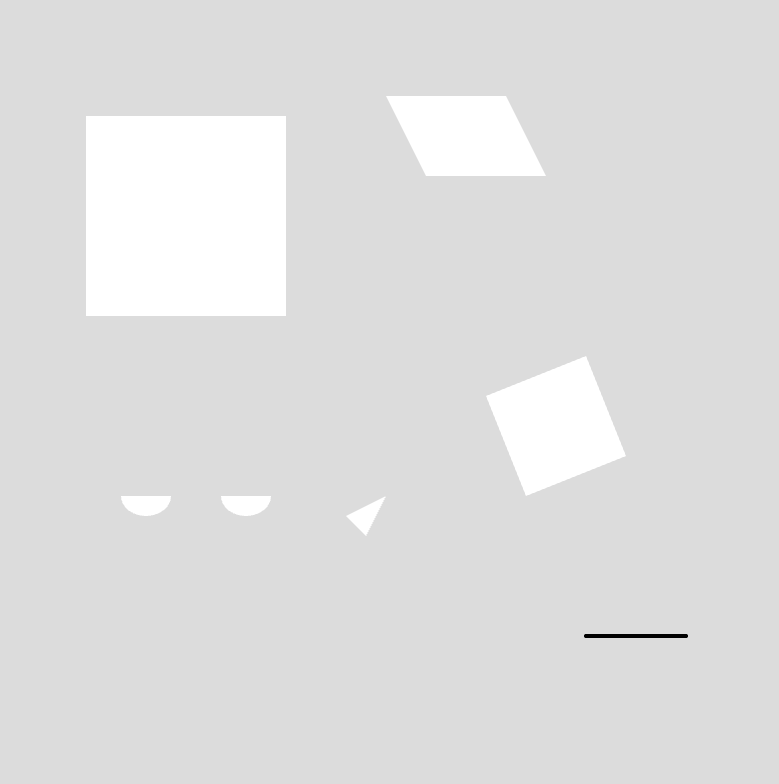
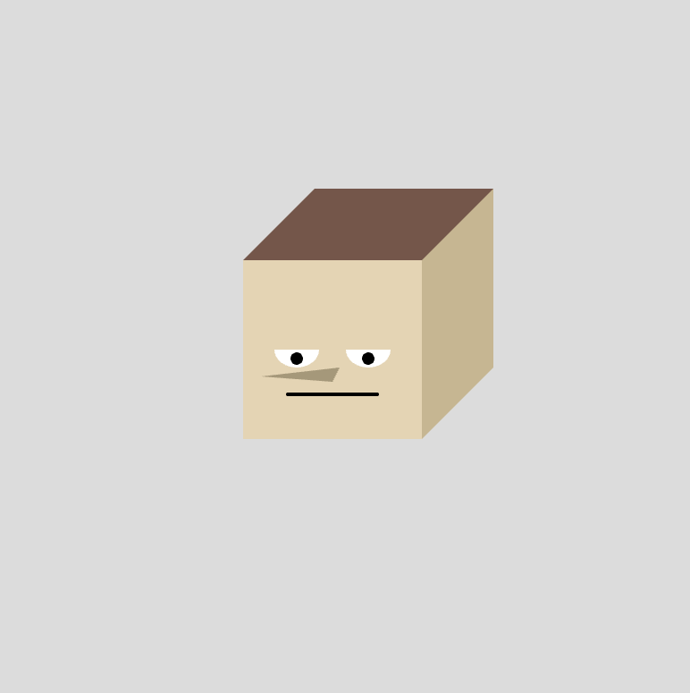
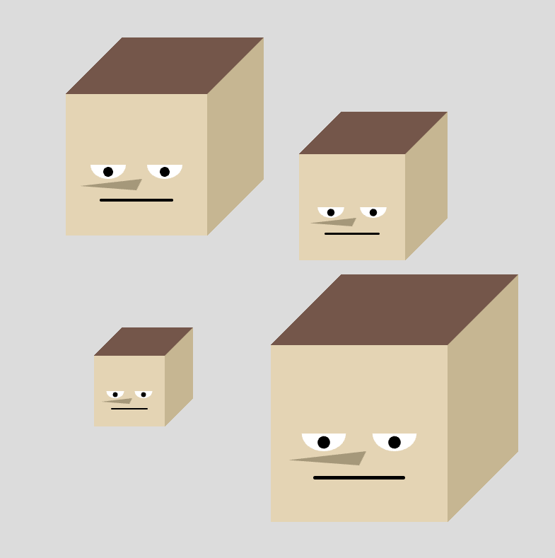
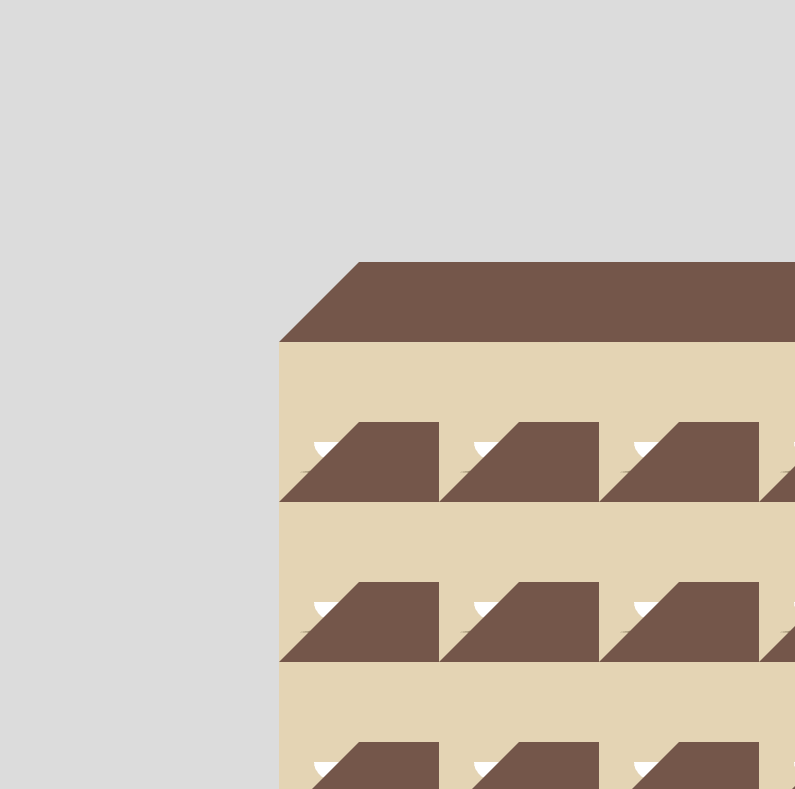
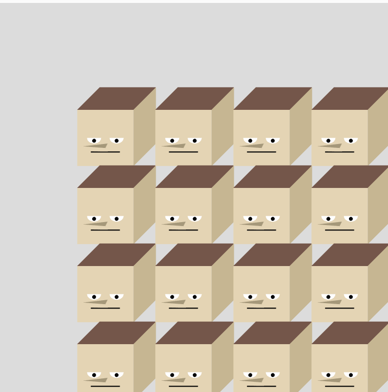
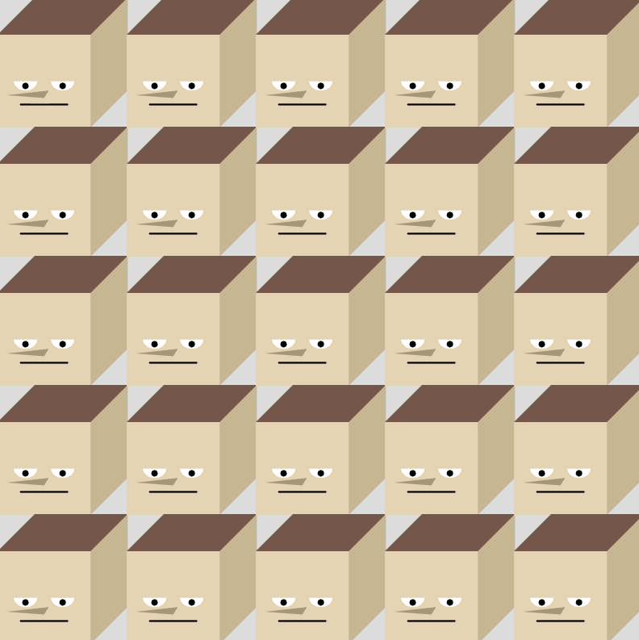

# My Midterm Project

### Phase 1 - The Sketch

This part just took like a couple minutes to make. I gave myself about 5-6 options for objects that I could try to create. The reason why I chose this object specifically is that it was going to force me to figure out many little things. 

Since the head is a cube, I'd have to figure out how to create that sense of "depth" for the cube. Which I'll explain in Phase 2 how I did this. And then just the selection of different shapes that I'd have to use for the whole object would give me some nice variety. 

### Phase 2 - Translating to P5.js

So this is where it got pretty tricky, because I was still trying to figure out P5 when I first started this project. So I started by just making a list of every single object that I'd need to make this object. The list goes as below:

- 1 square (front face)
- 2 quadrelaterals (hair and side face)
- 2 arcs that would form semi-circles (eyes)
- 2 circles (pupils)
- 1 triangle (nose)
- 1 line (mouth)

This was what the code looked like when I threw it all in 

So now that I have a sort of gameplan for what objects I needed, I just started by throwing them in. Not worried about proportions, positions, or colors quite yet. Just making sure I can see all of them on the canvas so that I can arrange them how I'd like

The trickest part of this process was figuring out how to do the hair and side face, and make them not only always be connected to the front face as one big object, but actually look like a cube. In order to be able and do this, I had to be really strict with how I decided the points for the quadrelaterals. 

I started by writing in my notes what the pixels for all 4 points of the square would come out to be. It wasn't really staring at me in the face because I decided to simplify the "square" function in my code, so I had to right it in my notes. And then I knew one thing that had to stay true, a needed to always have 2 points that were shared with the original square. For the hair, it was the top 2 points on the square that had to also be the bottom 2 points of the hair. And for the side face, the right-most 2 points on the square now had to be the left most points on that quadrelateral. And then from there, I decided to create a firm "offset" to consistently create a sense of "depth" for these quadrelaterals. And I got this idea literally by just staring at a cube for a solid 30 minutes while watching youtube and having a complete eureka moment.

So for how I applied this, for the hair I used a fixed number "40" (which I tested just looked the best) to push the x values on the top points right, and bring the y values down to make it look like we're look at it from an angel. And for the side face, it was just the inverse. Bring the x values on the right-most points more to the left, and shift the y values up. And finally, we got a nice looking cube.

From there, it was very easy. Just messing with the sizes and positions of the other face features (eyes, nose, mouth), and positioning them on the front face so that they look like the original sketch. And I of course added some color to the head as well, I didn't just do all that work to not glam my boy up a little. 

Also, I was trying to figure out how to get rid of the border on all of the shapes so that it would just look sleek, and I figured out how to do it in the references page too. I pretty much learned everything I needed to know for this project from there, and just to play it safe I'll link the source. 

[noStroke Function](https://p5js.org/reference/p5/noStroke/)

### Phase 3 - Making Bobby a Function

Turning the head into a function was actually fairly simple. First of all I just organized it all under a function called "Bobby" so that I can actually try and call it. And I made sure that the function was looking for the x, y, and z.

Once I had that setup, I just tested the function by running a "function draw()" and calling Bobby a few times. I knew that it wasn't going to work exactly how I wanted though because I hadn't fully setup everything, and sure enough, the scaling and everything was just pretty screwed up. 

In order to fix everything up, I just added in everything that you instructed us to in the guide for this phase. 

I first added `translate(x,y)` to make sure I could properly move Bobby wherever I want on the canvas. 

I then added `scale(s)` to make sure that when I scale him bigger or smaller, all of the "pixels" would stay proportional.

Lastly, I went to the very beginning and added the `push()`, and at the very end I added the `pop()`. This basically made sure that we're isolating each drawing's transformation, because I noticed without it, all of the Bobbys would just follow wahtever I set the first x, y, and s values to. And I know that it's kind of redundant to be explaining this to you since you probably know this way better than me, but I'm just tryna show that I kind of understand how it works too lol.

Anyways, with those changes, now I'm able to call Bobby as much as I want, and move him and scale him anywhere with no issues at all. 

### Phase 4 - Tiling Bobby like a Pro

Man we are so close, I can taste it. Everything is already set up in place for success, all that I have to do is replace the "function draw()" with a different function I called "drawBobbyGrid()" to get this to work.

I started by using some variables that I can edit to change how many columns and rows that I get. And I literally just called them "columns" and "rows" because I've been working on this midterm for forever, and I need to make it as straight forward for myself as I can. 

Now I saw in your guidance for phase 4, you suggested taking the size of the canvas, and dividing it by how many tiles we wanted in the grid in order to find the cellW and cellH. And I mean it works, but the issue is I'd have to change that value every single time I wanted to change how many columns and rows I wanted.

And so to make it a little sleeker, I actually discovered you can grab the width and height of the canvas by just calling for "width" and "height". And so by just putting that in and dividing width by columns and height by rows, now all I have to change is the number of columns and rows I want, and it does all the work automatically. And here's where I learned about how to do that.

[Canvas Width and Height](https://p5js.org/reference/p5/width/)

I also lowkey realized after I did this that I could just literally put in the canvas size width and height manually, and divide it by columns or rows, and it does the exact same thing (like literally just 500/columns). But ay, atleast I learned something new.

Anyways, now the fun part, the nested for-loop.

Now I'm gonna be honest, I was pretty tired, and so I just went back to our ControlFlow codealong, and used the chessboard as a starter since it had the counting function up to a certain variable, which I could then subsitute mine in. I do know how to do this from scratch, but it's been a long couple weeks. So let me credit you real quick for the giggles.

[ControlFlow CodeAlong](https://github.com/rdwrome/261fa25/blob/main/04ControlFlow/codealong.js)

(Also I substituted the y and x for i and j since I already was using those variables before, and I'm not tryna accidentally screw myself up)

Anyways, instead of calling for an if statement, I instead used two "let" statements to basically have the x and y values start in there proper positions based off of what the count is for the i or j, and the cell width and height that we have set. So for x, it looks like this:

`let x = i * cellW;`

And it looks the same for y, but instead with j and cellH

I then brought back the "s" variable to make sure and scale this all properly when I did the grid. And it went relatively smooth, although I realized that my "depth" value kind of screwed it up, and so I just threw in the .72 to make it smaller, and it looks solid.

`let s = min(cellW, cellH) * 0.72;`

And lastly, time to CALL IT. But of course I had to make a last little tweak because once again the depth decided to hate me. I noticed for the top row, the hair was always being cut off since the "top" of the head was starting at the top left of the face. This was an easy fix though, all I had to do was shift the y value down by the depth. 

`Bobby(x, y + s * 0.4, s);`

And this is where I got stumped for a little bit. The function was supposed to work, it all looked right, theoretically there wasn't anything wrong. And there were no ERRORS, so I had no idea where I was going wrong. Why was my screen completely blank. But then I just randomly decided to test what it would look like if I changed the scale(s). And so I just randomly changed it to scale(1), and FINALLY I saw something, a glimmer of hope.

And let's just say at this point, I just decided to brute force my way to the solution. And I realized repolacing it with a number wasn't going to work, so I just started dividing s by whatever I could think of to get it to work. And finally, I tried out `scale(s/100)`, and it actually worked. Now I tried to google it and figure out why this was the case, and I'll be honest, I still have no idea why it made me do this and why I only needed to do it for Phase 4, but atleast it's done.

But there was one last issue, because of course there had to be one last one lol. And it was a relatively easy but tedious fix. The issue was that since my initial square was based off of (140,150) for the starting point, it completely threw off where the grid began. And I sort of ignored this issue in Phase 3 and did weird calls for like `Bobby(-90,-80,1)` to push it more left. Which this worked temporarily, but now I can't ignore it. This is what the off grid looked like

So of course the answer was obvious, but I didn't know if I had the strength to do it. But my grade was on the line, so I must. So I went through every object, and subtracted 140 from every x value and 150 from every y value. This way, I would now be shifted relative to (0,0), so it looks great. 

So that was a lot, Phase 4 took a lot more work than I anticipated. But it's done, everything is working as it should, hopefully I didn't miss something but I'm way too tired to think straight anymore so this'll do.
